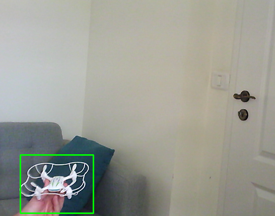
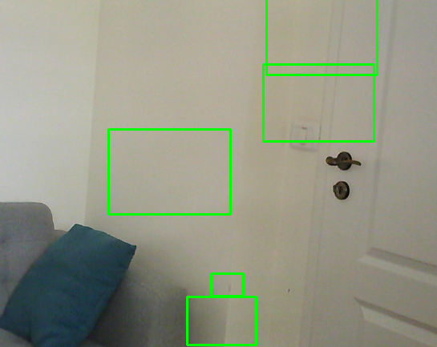

# Cascade_tools

Automate the retraining of cascade classifiers with OpenCV by providing:
- a simple annotation tool for image/video capture and save
- generation of additional positive images from existing positives and negatives
- retraining of OpenCV Cascade classifiers using HAAR, LBP features

<tr>
  <th>
  <a name="tracker" href=""></a>
  </th>
</tr>


# Directory structure

```
.
├── annotate.py -> image/video annotation tool
├── clean.sh -> clean all files directory for a new training
├── data -> cascade classifier output directory
├── genpos -> directory will contain the additional positives generated from the existing ones
├── genpos.sh -> generate additional positives from the existing ones
├── info -> images displayed in the readme file
├── LICENSE
├── neg -> holds the negative images for training
├── pos -> holds the positive images for training
├── prepare_data.py -> generate the dat files needed for OpenCV cascade tool
├── raw -> directory to store annotated images
├── README.md
├── test_cascade.py -> simple tools to test cascade classifier
└── train.sh -> start the training process
```

# How to use

The scrips are relying on the built-in tools of OpenCV, therefore, to work OpenCV must be installed first installed.
### Step 1 - opencv install
```
sudo apt-get install python-opencv
```
Test existence of the OpenCV cascade trainer tools, type in the terminal window:
```
opencv_[TAB]
```
The following list should appear:
```
opencv_annotation     opencv_traincascade   opencv_visualisation
opencv_createsamples  opencv_version
```
If we have the screen above, we are settled.

### Step 2 - Collect negative and positive images

Cascade is very sensitive to the training data, therefore by collecting the negative samples, makes sure that no object which follows to be detected is contained. Negatives can be collected from the internet, the format shall be *.jpg, size does not matter.

Collecting positive samples can happen using the annotation tool. Captures will be saved in the "raw" directory
```
python3 annotate.py --help
usage: annotate.py [-h] [-cam CAM] [-vid VID]

Simple annotation tool Use "a" to start to annotate, ENTER to return

optional arguments:
  -h, --help  show this help message and exit
  -cam CAM    Camera index
  -vid VID    Video file

```

Usually, there are needed about ~300 positive images and 1000-1200 negatives for reasonable training with less false positives.

### Step 3 - Retrain Cascade classifier

The train.sh script does the 'dirty work'. There are many hyperparameters to set, which can influence the classification accuracy but training time too.
```
# Number of training stages
nrStages=20

# detection types [HAAR,LBP]
fn=HAAR
# object size, width, height
imgw=30
imgh=21
```
Usually, a well-trained cascade will reach 20 stages of the training. HAAR is slower than LBP, but more accurate. The image size by default is (24,24), here is settled for rectangle objects. Changing these parameters will have a high impact on training time.

In case everything went well, the training will start...
```
===== TRAINING 0-stage =====
<BEGIN
POS count : consumed   13 : 13
NEG count : acceptanceRatio    13 : 1
Precalculation time: 0
+----+---------+---------+
|  N |    HR   |    FA   |
+----+---------+---------+
|   1|        1|        1|
+----+---------+---------+
|   2|        1|        0|
+----+---------+---------+
END>
Training until now has taken 0 days 0 hours 0 minutes 0 seconds.
```
After the training has finished (i.e. max number of stages reached), a 'cascade.xml' fill will be created automatically in the 'data' folder.

### Step 4 - testing the results

After the 'cascade.xml' file was created, testing follows. Use the below provided utility for fast feedback.
```
python3 test_cascade.py --help
usage: test_cascade.py [-h] [-cam CAM] [-n N] [-s S]

Cascade tester. Defaults: -cam 0 -n 0 -s 1.1

optional arguments:
  -h, --help  show this help message and exit
  -cam CAM    Camera ID
  -n N        Number of neighbors for detections
  -s S        Scale factor

```
If there appears a lot of random detections (false positives):
<tr>
  <th>
  <a name="tracker" href=""></a>
  </th>
</tr>

- try to adjust the classifier hyperparameters in 'test_cascade.py' file
```
python3 test_cascade.py -n 2 -s 1.2
```
- increase the number of positive/negative samples, use 'clean.sh' to clear the intermediate files and retrain the cascade classifier till the results are acceptable.


# Resources

https://docs.opencv.org/2.4/doc/user_guide/ug_traincascade.html

/Enjoy.
